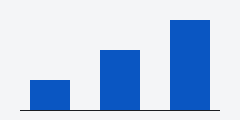

This sample post exists only for the tests in `tests/site/test_blog.py`. It is a draft, so only `tff-site build --drafts` publishes it, the way the test site does.

## What a post can hold

A post is Markdown with raw HTML off, so <b>tags</b> show as text. It can link to [the About page](/about/), to [the tiers on How we rank](/methodology/#tiers), and to other sites, such as [the CC BY-SA 4.0 deed](https://creativecommons.org/licenses/by-sa/4.0/).

- Lists, **bold** and *italic* text, and `code`.
- Brief quotes:

> A truly free font has no use restrictions.

## Images

Images sit beside the post and are named by their file name alone.

### The same image twice

It is published once: 
